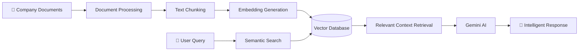

# 🚀 NEXE.AGENT AI Knowledge Assistant

  

---

# 📚 AI Knowledge Assistant

A **production-style RAG-based AI Knowledge Assistant** developed during the AI & Automation Internship at NEXE.AGENT.

This project is designed as a complete **AI-powered web application** that allows companies to upload internal documents and interact with them using natural language queries — similar to **“ChatGPT for Company Documents.”**

The system intelligently processes uploaded files, generates embeddings, stores contextual knowledge in a vector database, and delivers highly relevant AI-powered responses using **Google Gemini AI** and **Retrieval-Augmented Generation (RAG)**.

---

# ✨ Features

## 🤖 AI-Powered Document Chat

* Ask questions from uploaded company documents
* Context-aware intelligent responses
* Semantic search with embeddings
* Gemini AI integration

## 📂 Smart File Upload System

* Upload PDF, DOCX, TXT files
* Automatic document processing
* Text chunking & indexing
* Embedding generation pipeline

## ⚡ RAG Pipeline

* Retrieval-Augmented Generation architecture
* Vector similarity search
* Context injection into prompts
* Accurate company-specific responses

## 🎨 Modern Frontend

* Beautiful React chat interface
* Real-time messaging UI
* Responsive design
* Drag & drop file upload

## 🔒 Backend Architecture

* Python FastAPI backend
* REST APIs
* AI orchestration layer
* Embedding management
* Vector database integration

---

# 🏗️ System Architecture

---

# 👨‍💻 Developed During Internship

Developed By Muhammad Yasir as part of the **AI & Automation Internship** at NEXE.AGENT.

---

# 🌟 Project Vision

This project demonstrates how modern AI systems can transform traditional company documentation into an intelligent conversational knowledge system powered by:

* RAG Architecture
* Semantic Search
* Vector Databases
* Large Language Models
* AI Automation

---

# ⭐ If you like this project, give it a star!

### Built with ❤️ using Python, React & Gemini AI

